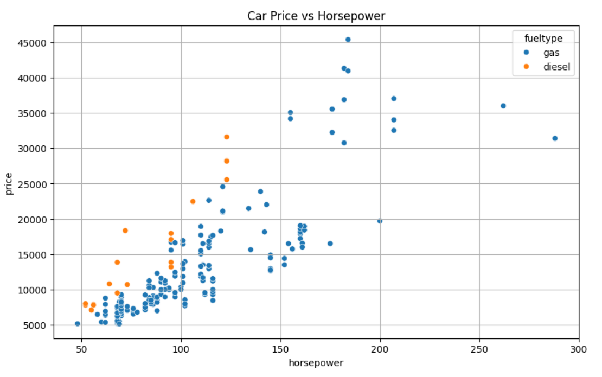
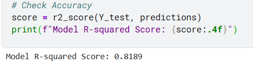

# Car Price Prediction using Machine Learning 

# Project Overview
In this final task for my CodeAlpha internship, I developed a Multiple Linear Regression model to predict car prices based on various automotive features like horsepower, engine size, and fuel type.

# Key Insights
- **Model Performance:** Achieved an **R-squared score of 0.8189**, indicating high predictive accuracy.
- **Correlation:** A strong positive correlation was observed between Horsepower and Price across both gas and diesel vehicles.

# Visualizations

# Tech Stack
- **Language:** Python
- **Libraries:** Pandas, Scikit-Learn, Seaborn, Matplotlib
- **Model:** Linear Regression
